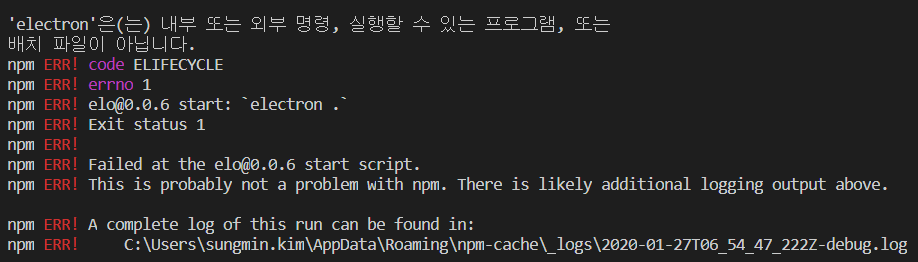
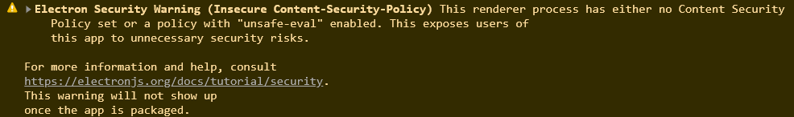
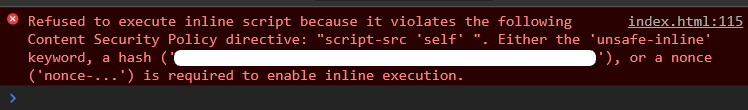

# Issue
### [(main)](/readme.md) 
***
### -- Program --
* [Maya](#1-maya)
* [Nuke](#2-nuke)
* [Houdini](#3-houdini)
* [3DEqualizer](#4-3dequalizer)
* [Tractor](#5-tractor)
* [Unity3D](#6-unity3d)
* [Unreal](#7-unreal)
* [AndroidStudio](#8-androidstudio)
***
### -- Language --  
* [C](#9-c)
* [C++](#10-c)
* [C#](#11-c)
* [Java](#12-java)
* [JavaScript](#13-javascript)
* [TypeScript](#14-typescript)
* [Python](#15-python)
* [GoLang](#16-golang)
* [Html](#17-html)
* [Jsp](#18-jsp)
***
#### 1. Maya
***
#### 2. Nuke
***
#### 3. Houdini
***
#### 4. 3DEqualizer
***
#### 5. Tractor
***
#### 6. Unity3D
***
#### 7. Unreal
***
#### 8. AndroidStudio
***
#### 9. C
***
#### 10. C++
***
#### 11. C#
***
#### 12. Java
***
#### 13. JavaScript
***
#### 14. TypeScript
:large_blue_diamond:**npm start Error**:large_blue_diamond: 
- ex) 만약 electron 에러일시, 
 
npm install electron -g (에러난 모듈을 설치해야함.) 

:large_blue_diamond:**Electron Security Warning 해결방법**:large_blue_diamond: 
문제) 아래와 같은 경고 표시가 나옴. 
 
해결방법) 
1. html의 head 부분에 코드를 넣음. 
코드) **< meta http-equiv="Content-Security-Policy" content="script-src 'self' " />**  
2. 그럼 에러가 나오는데, 아래사진의 하얀색 박스에 나온 코드를 content="script-src '여기부분' " 
여기부분이란 곳에 추가하게 되면 경고가 사라짐. 
 
***
#### 15. Python
***
#### 16. GoLang
***
#### 17. Html
***
#### 18. Jsp
***